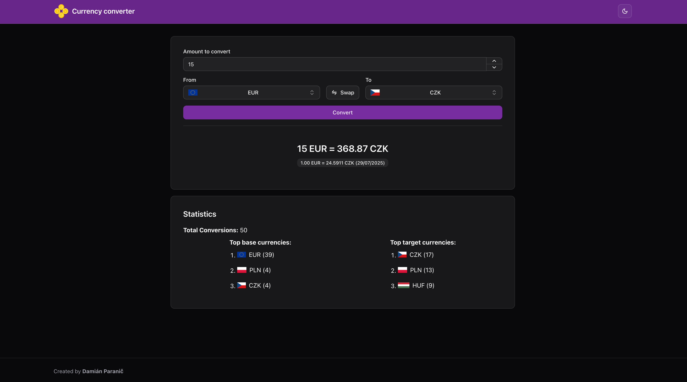

# Currency converter APP
Simple currency converter app

Created by **Damián Paranič**

## Technologies used
- [Next.js](https://nextjs.org)
- [Prisma](https://www.prisma.io)
- [PostgreSQL](https://www.postgresql.org)
- [TRPC](https://trpc.io)
- [Fastify](https://fastify.dev/)
- [Turborepo](https://turborepo.com/)


## File structure
```
.
├── apps
│   ├── api
│   │   └── # Source code for the Fastify API server
│   └── web
│       └── # Source code for the Next.js web application
└── packages        
    ├── confis-eslint
    │   └── # ESLint configuration shared across the monorepo
    ├── config-typescript  
    │   └── # TypeScript configuration shared across the monorepo
    ├── db
    │   └── # Prisma database setup and migrations
    ├── shared
    │   └── # Shared utilities and types used across the monorepo
    └── trpc
        └── # TRPC setup with procedures and routers
```

## Getting Started
### Prerequisites
- [Node.js](https://nodejs.org)
- [pnpm](https://pnpm.io)
- [Docker](https://www.docker.com)

### Setup
Use setup script or follow manual steps below:
#### Script
```bash
./setup.sh
```
#### Manual Steps

1. Clone and checkout the repository
2. Create `.env` file in the root directory based on template `.env.example`
3. Start the PostgreSQL database using Docker
   ```bash
   docker compose up -d
   ```
4. Install dependencies
   ```bash
   pnpm install
   ```
5. Setup the database
   ```bash
   pnpm run db:deploy
   pnpm run db:seed
   ```
6. Start the application
   ```bash
   pnpm run start
   ```
7. Check API at `http://localhost:5000/trpc/health`
8. Seed the database with exchange rates by visiting `http://localhost:5000/trpc/exchangeRate.updateExchangeRates`
   - this is supposed to run periodically every day using a cron job (future improvement ⏳)
9. Visit the web application at `http://localhost:3000`


### Showcase

